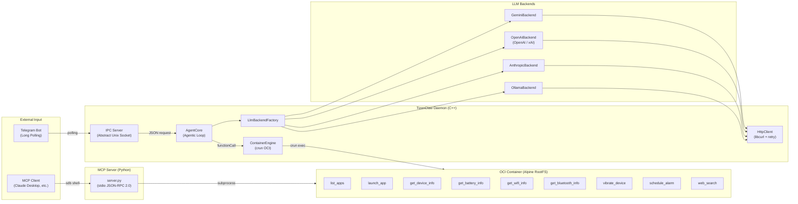

# TizenClaw Project Analysis

> **Last Updated**: 2026-03-05

---

## 1. Project Overview

**TizenClaw** is a **Native C++ AI Agent system daemon** running on the Tizen Embedded Linux platform.

It interprets natural language prompts through multiple LLM backends (Gemini, OpenAI, Claude, xAI, Ollama), executes Python skills inside OCI containers (crun), and controls the device. It autonomously performs complex tasks through a Function Calling-based iterative loop (Agentic Loop).



---

## 2. Project Structure

```
tizenclaw/
├── src/                             # Source and headers
│   ├── tizenclaw/                   # Daemon core source and headers
│   └── common/                      # Common utilities (logging, etc.)
│   ├── tizenclaw.cc                 # Daemon main, IPC server, signal handling
│   ├── agent_core.cc                # Agentic Loop, skill dispatch, session mgmt
│   ├── container_engine.cc          # OCI container lifecycle management (crun)
│   ├── http_client.cc               # libcurl HTTP Post (retry, timeout, SSL)
│   ├── llm_backend_factory.cc       # Backend factory pattern
│   ├── gemini_backend.cc            # Google Gemini API integration
│   ├── openai_backend.cc            # OpenAI / xAI (Grok) API integration
│   ├── anthropic_backend.cc         # Anthropic Claude API integration
│   ├── ollama_backend.cc            # Ollama local LLM integration
│   └── telegram_bridge.cc           # Telegram Listener process mgmt (fork+exec)
├── CMakeLists.txt
│   ├── tizenclaw.hh                 # TizenClawDaemon class
│   ├── agent_core.hh                # AgentCore class
│   ├── container_engine.hh          # ContainerEngine class
│   ├── llm_backend.hh               # LlmBackend abstract interface
│   ├── http_client.hh               # HttpClient/HttpResponse
│   ├── gemini_backend.hh
│   ├── openai_backend.hh            # OpenAI + xAI shared
│   ├── anthropic_backend.hh
│   ├── ollama_backend.hh
│   ├── telegram_bridge.hh           # TelegramBridge class
│   └── nlohmann/json.hpp            # JSON parser (header-only)
├── skills/                          # Python skills (12 directories)
│   ├── common/                      # Shared utilities
│   │   └── tizen_capi_utils.py      # ctypes-based Tizen C-API wrapper
│   ├── list_apps/                   # List installed apps
│   ├── launch_app/                  # Launch an app
│   ├── get_device_info/             # Device info query
│   ├── get_battery_info/            # Battery status query
│   ├── get_wifi_info/               # Wi-Fi status query
│   ├── get_bluetooth_info/          # Bluetooth status query
│   ├── vibrate_device/              # Haptic vibration
│   ├── schedule_alarm/              # Alarm scheduling
│   ├── web_search/                  # Web search (Wikipedia API)
│   ├── telegram_listener/           # Telegram Bot bridge
│   └── mcp_server/                  # MCP Server (stdio, JSON-RPC 2.0)
├── scripts/                         # Container & infra scripts (6)
│   ├── run_standard_container.sh    # Daemon OCI container (cgroup fallback)
│   ├── skills_secure_container.sh   # Skill execution secure container
│   ├── build_rootfs.sh              # Alpine RootFS builder
│   ├── start_mcp_tunnel.sh          # MCP tunnel via SDB
│   ├── fetch_crun_source.sh         # crun source downloader
│   └── Dockerfile                   # RootFS build reference
├── data/
│   ├── llm_config.json.sample       # LLM config sample
│   ├── telegram_config.json.sample  # Telegram Bot config sample
│   └── rootfs.tar.gz                # Alpine RootFS (49 MB)
├── test/unit_tests/                 # gtest/gmock unit tests
│   ├── agent_core_test.cc           # AgentCore tests (4 cases)
│   ├── container_engine_test.cc     # ContainerEngine tests (3 cases)
│   ├── main.cc                      # gtest main
│   └── mock/                        # Mock headers
├── packaging/                       # RPM packaging & systemd
│   ├── tizenclaw.spec               # GBS RPM build spec (crun source build)
│   ├── tizenclaw.service            # Daemon systemd service
│   ├── tizenclaw-skills-secure.service  # Skills container systemd service
│   └── tizenclaw.manifest           # Tizen SMACK manifest
├── docs/                            # Documentation
├── CMakeLists.txt                   # Build system (C++17)
└── third_party/                     # crun 1.26 source (source build)
```

---

## 3. Core Module Details

### 3.1 System Core

| Module | Files | Role | LOC | Status |
|--------|-------|------|-----|--------|
| **Daemon** | `tizenclaw.cc/hh` | Tizen Core event loop, SIGINT/SIGTERM handling, IPC server thread, TelegramBridge mgmt | 335 | ✅ |
| **AgentCore** | `agent_core.cc/hh` | Agentic Loop (max 5 iterations), per-session history (max 20 turns), parallel tool exec (`std::async`) | 304 | ✅ |
| **ContainerEngine** | `container_engine.cc/hh` | crun-based OCI container create/run, dynamic `config.json`, namespace isolation, `crun exec` | 348 | ✅ |
| **HttpClient** | `http_client.cc/hh` | libcurl POST, exponential backoff retry, SSL CA auto-discovery, timeouts | 137 | ✅ |

### 3.2 LLM Backend Layer

| Backend | Source File | API Endpoint | Default Model | Status |
|---------|-------------|-------------|---------------|--------|
| **Gemini** | `gemini_backend.cc` | `generativelanguage.googleapis.com` | `gemini-2.5-flash` | ✅ |
| **OpenAI** | `openai_backend.cc` | `api.openai.com/v1` | `gpt-4o` | ✅ |
| **xAI (Grok)** | `openai_backend.cc` (shared) | `api.x.ai/v1` | `grok-3` | ✅ |
| **Anthropic** | `anthropic_backend.cc` | `api.anthropic.com/v1` | `claude-sonnet-4-20250514` | ✅ |
| **Ollama** | `ollama_backend.cc` | `localhost:11434` | `llama3` | ✅ |

- **Abstraction**: `LlmBackend` interface → `LlmBackendFactory::Create()` factory
- **Shared structs**: `LlmMessage`, `LlmResponse`, `LlmToolCall`, `LlmToolDecl`
- **Runtime switching**: Backend swappable via `active_backend` field in `llm_config.json`

### 3.3 IPC & Communication

| Module | Implementation | Protocol | Status |
|--------|---------------|----------|--------|
| **IPC Server** | `tizenclaw.cc::IpcServerLoop()` | Abstract Unix Socket (`\0tizenclaw.sock`), bidirectional JSON | ✅ |
| **UID Auth** | `IsAllowedUid()` | `SO_PEERCRED` based, root/app_fw/system/developer | ✅ |
| **Telegram Listener** | `telegram_listener.py` | Bot API Long-Polling → IPC Socket → sendMessage reply | ✅ |
| **TelegramBridge** | `telegram_bridge.cc/hh` | `fork()+execv()` child process, watchdog restart (3x, 5s) | ✅ |
| **MCP Server** | `mcp_server/server.py` | stdio JSON-RPC 2.0, `sdb shell` tunneling | ✅ |

### 3.4 Skills System

| Skill | manifest.json | Parameters | Tizen C-API | Status |
|-------|--------------|-----------|-------------|--------|
| `list_apps` | ✅ | None | `app_manager` | ✅ |
| `launch_app` | ✅ | `app_id` (string, required) | `app_control` | ✅ |
| `get_device_info` | ✅ | None | `system_info` | ✅ |
| `get_battery_info` | ✅ | None | `device` (battery) | ✅ |
| `get_wifi_info` | ✅ | None | `wifi-manager` | ✅ |
| `get_bluetooth_info` | ✅ | None | `bluetooth` | ✅ |
| `vibrate_device` | ✅ | `duration_ms` (int, optional) | `feedback` / `haptic` | ✅ |
| `schedule_alarm` | ✅ | `delay_sec` (int), `prompt_text` (string) | `alarm` | ✅ |
| `web_search` | ✅ | `query` (string, required) | None (Wikipedia API) | ✅ |

- **Shared utility**: `skills/common/tizen_capi_utils.py` (ctypes wrapper, error handling, library loader)
- **Skill input**: `CLAW_ARGS` environment variable (JSON)
- **Skill output**: stdout JSON → captured by `ContainerEngine::ExecuteSkill()`

### 3.5 Container Infrastructure

| Component | File | Role |
|-----------|------|------|
| **Standard Container** | `run_standard_container.sh` | Daemon process execution (cgroup disabled, chroot fallback) |
| **Skills Secure Container** | `skills_secure_container.sh` | Long-running skill sandbox (no capabilities, unshare fallback) |
| **RootFS Builder** | `build_rootfs.sh` / `Dockerfile` | Alpine-based RootFS creation |
| **crun Source Build** | `tizenclaw.spec` | Build crun 1.26 from source during RPM build |

### 3.6 Build & Packaging

| Item | Details |
|------|---------|
| **Build System** | CMake 3.0+, C++17, `pkg-config` (tizen-core, glib-2.0, dlog, libcurl) |
| **Packaging** | GBS RPM (`tizenclaw.spec`), includes crun source build |
| **systemd** | `tizenclaw.service` (Type=simple), `tizenclaw-skills-secure.service` (Type=oneshot) |
| **Testing** | gtest/gmock, `ctest -V` run during `%check` |
| **Test Targets** | `AgentCoreTest` (4 cases), `ContainerEngineTest` (3 cases) |

---

## 4. Completed Development Phases

### Phase 1: Foundation Architecture ✅
- C++ Native daemon skeleton (`tizenclaw.cc`, Tizen Core event loop)
- `LlmBackend` abstract interface with factory pattern
- 5 LLM backends: Gemini, OpenAI, Anthropic (Claude), xAI (Grok), Ollama
- Runtime backend switching via `llm_config.json`
- `HttpClient` common module: exponential backoff retry, SSL CA auto-discovery

### Phase 2: Container Execution Environment ✅
- `ContainerEngine` module: crun-based OCI container lifecycle management
- Dynamic `config.json` generation (namespace isolation, mount config, capability limits)
- Dual container architecture: Standard (daemon) + Skills Secure (skill sandbox)
- `unshare + chroot` fallback when cgroup unavailable
- crun 1.26 source build integrated into RPM spec

### Phase 3: Agentic Loop & Function Calling ✅
- Dynamic skill manifest loading → `LlmToolDecl` conversion → Function Calling
- Agentic Loop with max 5 iterations (tool call → execute → feedback → next)
- Parallel tool execution support (`std::async`)
- Session memory: per-user conversation history (max 20 turns)

### Phase 4: Skills System ✅
- 9 functional skills (list_apps, launch_app, device/battery/wifi/bt info, vibrate, alarm, web_search)
- `tizen_capi_utils.py`: ctypes-based shared utility module
- `CLAW_ARGS` env var → JSON stdout I/O convention

### Phase 5: Communication & External Integration ✅
- Bidirectional JSON IPC: Abstract Unix Domain Socket (`\0tizenclaw.sock`)
- `SO_PEERCRED`-based UID authentication (root, app_fw, system, developer only)
- Telegram Listener: Bot API Long-Polling → IPC → response relay
- MCP Server: stdio JSON-RPC 2.0, PC-device connection via `sdb shell` tunnel
- Claude Desktop can directly control Tizen devices

---

## 5. Competitive Analysis: Gap Analysis vs OpenClaw & NanoClaw

> **Analysis Date**: 2026-03-05
> **Targets**: OpenClaw, NanoClaw

### 5.1 Project Scale Comparison

| Item | **TizenClaw** | **OpenClaw** | **NanoClaw** |
|------|:---:|:---:|:---:|
| Language | C++ / Python | TypeScript | TypeScript |
| Source files | ~44 | ~700+ | ~50 |
| Skills | 9 | 52 | 5+ (skills-engine) |
| LLM Backends | 5 | 15+ | Claude SDK |
| Channels | 2 (Telegram, MCP) | 8+ | 5 (WhatsApp, Telegram, Slack, Discord, Gmail) |
| Test coverage | 7 cases | Hundreds | Dozens |
| Plugin system | ❌ | ✅ (npm-based) | ❌ |

### 5.2 Gap List

#### 🔴 High Priority (Core Feature Gaps)

**Memory / Conversation Persistence**

| Item | OpenClaw | NanoClaw | TizenClaw Status |
|------|---------|----------|-----------------|
| History storage | SQLite + Vector DB | SQLite | **In-memory only** (lost on restart) |
| Embedding search | Multi-backend | Per-group `CLAUDE.md` | ❌ None |
| Semantic search | MMR algorithm | ❌ | ❌ None |

**Context Window Management**

| Item | OpenClaw | NanoClaw | TizenClaw Status |
|------|---------|----------|-----------------|
| Context compression | `compaction.ts` — auto-summarization | Session history limit | Simple 20-turn trimming |
| Token counting | Per-model accurate counting | ❌ | ❌ None |
| Context guard | Auto-summarize on overflow | ❌ | ❌ None |

**Security Hardening**

| Item | OpenClaw | NanoClaw | TizenClaw Status |
|------|---------|----------|-----------------|
| Audit | `audit.ts` (45K LOC) | `ipc-auth.test.ts` | `SO_PEERCRED` UID check only |
| Skill scanner | Malicious skill detection | ❌ | ❌ None |
| Sender allowlist | `allowlist-match.ts` | `sender-allowlist.ts` | ❌ None |
| Secret management | API key rotation | stdin delivery | `llm_config.json` plaintext |
| Tool execution policy | Whitelist/blacklist | ❌ | ❌ None |

**IPC Protocol Enhancement**

| Item | OpenClaw | NanoClaw | TizenClaw Status |
|------|---------|----------|-----------------|
| Message framing | WebSocket + JSON-RPC | Sentinel marker parsing | `shutdown(SHUT_WR)` EOF |
| Streaming responses | SSE / WebSocket | `onOutput` callback | ❌ Blocking only |
| Concurrent clients | Parallel sessions | Fair scheduling queue | Sequential |

#### 🟡 Medium Priority (Extensibility Gaps)

| Area | OpenClaw | NanoClaw | TizenClaw Status |
|------|---------|----------|-----------------|
| Task scheduler | Basic cron | cron/interval/one-shot | `schedule_alarm` only |
| Channel registry | Static | Self-registration | Hardcoded |
| Model fallback | Auto-switch (18K LOC) | ❌ | ❌ Error only |
| Tool loop detection | 18K LOC detector | Timeout + idle | `kMaxIterations = 5` |
| tool_call_id mapping | Accurate tracking | Claude SDK native | Hardcoded IDs |

#### 🟢 Low Priority (UX/Infrastructure Gaps)

| Area | OpenClaw | NanoClaw | TizenClaw Status |
|------|---------|----------|-----------------|
| Skill lifecycle | Remote install/verify | apply/rebase/uninstall | Manual copy |
| System prompt | Dynamic generation | Per-group custom | Hardcoded string |
| DB engine | SQLite + sqlite-vec | SQLite | ❌ None |
| Session recovery | Crash recovery | Pending msg recovery | ❌ |
| Logging | Structured (Pino) | Pino (JSON) | dlog (plain text) |
| Usage tracking | Per-model token usage | ❌ | ❌ |

---

## 6. TizenClaw Unique Strengths

| Strength | Description |
|----------|-------------|
| **Native C++ Performance** | Lower memory/CPU vs TypeScript. Optimal for embedded |
| **OCI Container Isolation** | crun-based `seccomp` + `namespace`. Finer syscall control than OpenClaw/NanoClaw |
| **Direct Tizen C-API** | ctypes wrappers for device hardware (battery, Wi-Fi, Bluetooth, haptic, etc.) |
| **Multi-LLM Support** | 5 backends (Gemini, OpenAI, Claude, xAI, Ollama) switchable at runtime |
| **Lightweight Deployment** | systemd service + RPM packaging. Standalone device execution |
| **MCP Server** | Unique ability to control devices from Claude Desktop via sdb |

---

## 7. Technical Debt & Improvement Areas

| Item | Current State | Improvement Direction |
|------|-------------|----------------------|
| IPC message framing | `shutdown(SHUT_WR)` EOF detection | Length-prefix protocol (multi request/response) |
| tool_call_id mapping | `call_0`, `toolu_0` hardcoded | Track actual IDs from LLM responses |
| API key management | `llm_config.json` plaintext | KeyManager or encrypted storage |
| SSL verification | CA bundle auto-discovery (✅ improved) | Tizen platform CA path integration |
| Error logging | dlog only | Structured logging (leveled + remote collection) |
| Skill output parsing | Raw stdout JSON | JSON schema validation |
| MCP Server execution | `subprocess` for direct skill execution | Daemon IPC for Agentic Loop utilization |
| Concurrent IPC | Sequential (one client at a time) | Thread pool or async I/O |

---

## 8. Code Statistics

| Category | Files | LOC |
|----------|-------|-----|
| C++ Source (`src/tizenclaw/*.cc`) | 10 | ~2,070 |
| C++ Headers (`src/tizenclaw/*.hh`) | 10 | ~440 |
| Python Skills & Utils | ~20 | ~1,100 |
| Shell Scripts | 6 | ~500 |
| **Total** | ~44 | ~3,770 |
