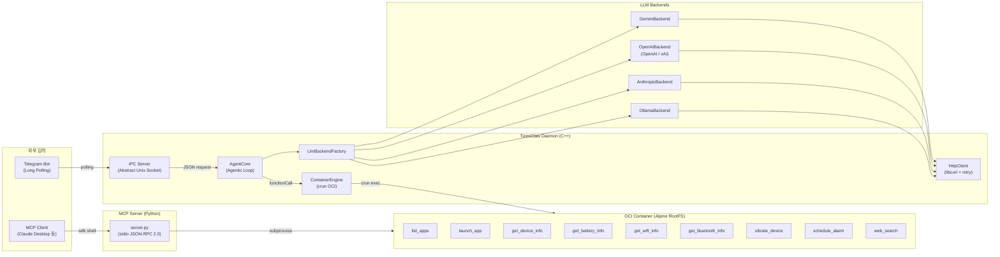

# TizenClaw 프로젝트 분석

> **최종 업데이트**: 2026-03-05

---

## 1. 프로젝트 개요

**TizenClaw**는 Tizen Embedded Linux 환경에서 동작하는 **Native C++ AI Agent 시스템 데몬**입니다.

사용자의 자연어 프롬프트를 다중 LLM 백엔드(Gemini, OpenAI, Claude, xAI, Ollama)를 통해 해석하고, OCI 컨테이너(crun) 안에서 Python 스킬을 실행하여 디바이스를 제어합니다. Function Calling 기반의 반복 루프(Agentic Loop)를 통해 복합 작업을 자율적으로 수행합니다.



---

## 2. 프로젝트 구조

```
tizenclaw/
├── src/                             # 소스 및 헤더
│   ├── tizenclaw/                   # 데몬 코어 소스코드 및 헤더
│   └── common/                      # 공통 유틸리티 (로깅 등)
│   ├── tizenclaw.cc                 # 데몬 메인, IPC 서버, 시그널 핸들링
│   ├── agent_core.cc                # Agentic Loop, 스킬 디스패치, 세션 관리
│   ├── container_engine.cc          # OCI 컨테이너 생명주기 관리 (crun)
│   ├── http_client.cc               # libcurl HTTP Post (재시도, 타임아웃, SSL)
│   ├── llm_backend_factory.cc       # 백엔드 팩토리 패턴
│   ├── gemini_backend.cc            # Google Gemini API 연동
│   ├── openai_backend.cc            # OpenAI / xAI (Grok) API 연동
│   ├── anthropic_backend.cc         # Anthropic Claude API 연동
│   ├── ollama_backend.cc            # Ollama 로컬 LLM 연동
│   └── telegram_bridge.cc           # Telegram Listener 프로세스 관리 (fork+exec, watchdog)
├── CMakeLists.txt
│   ├── tizenclaw.hh                 # TizenClawDaemon 클래스
│   ├── agent_core.hh                # AgentCore 클래스
│   ├── container_engine.hh          # ContainerEngine 클래스
│   ├── llm_backend.hh               # LlmBackend 추상 인터페이스, 공유 구조체
│   ├── http_client.hh               # HttpClient/HttpResponse
│   ├── gemini_backend.hh
│   ├── openai_backend.hh            # OpenAI + xAI 공용
│   ├── anthropic_backend.hh
│   ├── ollama_backend.hh
│   ├── telegram_bridge.hh           # TelegramBridge 클래스
│   └── nlohmann/json.hpp            # JSON 파서 (header-only)
├── skills/                          # Python 스킬 (12개 디렉터리)
│   ├── common/                      # 공용 유틸리티
│   │   └── tizen_capi_utils.py      # ctypes 기반 Tizen C-API 래퍼
│   ├── list_apps/                   # 설치된 앱 목록 조회
│   ├── launch_app/                  # 앱 실행
│   ├── get_device_info/             # 디바이스 정보 조회
│   ├── get_battery_info/            # 배터리 상태 조회
│   ├── get_wifi_info/               # Wi-Fi 상태 조회
│   ├── get_bluetooth_info/          # 블루투스 상태 조회
│   ├── vibrate_device/              # 햅틱 진동
│   ├── schedule_alarm/              # 알람 스케줄링
│   ├── web_search/                  # 웹 검색 (Wikipedia API)
│   ├── telegram_listener/           # Telegram Bot 브릿지
│   └── mcp_server/                  # MCP 서버 (stdio, JSON-RPC 2.0)
├── scripts/                         # 컨테이너 & 인프라 스크립트 (6개)
│   ├── run_standard_container.sh    # 데몬용 OCI 컨테이너 (cgroup fallback 포함)
│   ├── skills_secure_container.sh   # 스킬 실행용 보안 컨테이너
│   ├── build_rootfs.sh              # Alpine RootFS 빌드
│   ├── start_mcp_tunnel.sh          # SDB를 통한 MCP 터널 시작
│   ├── fetch_crun_source.sh         # crun 소스 다운로드
│   └── Dockerfile                   # RootFS 빌드 참고용
├── data/
│   ├── llm_config.json.sample       # LLM 설정 샘플
│   ├── telegram_config.json.sample  # Telegram Bot 설정 샘플
│   └── rootfs.tar.gz                # Alpine RootFS (49 MB)
├── test/unit_tests/                 # gtest/gmock 단위 테스트
│   ├── agent_core_test.cc           # AgentCore 테스트 (4개 케이스)
│   ├── container_engine_test.cc     # ContainerEngine 테스트 (3개 케이스)
│   ├── main.cc                      # gtest main
│   └── mock/                        # Mock 헤더
├── packaging/                       # RPM 패키징 & systemd
│   ├── tizenclaw.spec               # GBS RPM 빌드 스펙 (crun 소스 빌드 포함)
│   ├── tizenclaw.service            # 데몬 systemd 서비스
│   ├── tizenclaw-skills-secure.service  # 스킬 컨테이너 systemd 서비스
│   └── tizenclaw.manifest           # Tizen SMACK 매니페스트
├── docs/                            # 문서
├── CMakeLists.txt                   # 빌드 시스템 (C++17)
└── third_party/                     # crun 1.26 소스 (소스 빌드)
```

---

## 3. 핵심 모듈 상세

### 3.1 시스템 코어

| 모듈 | 파일 | 역할 | LOC | 상태 |
|------|------|------|-----|------|
| **Daemon** | `tizenclaw.cc/hh` | Tizen Core 이벤트 루프, SIGINT/SIGTERM 핸들링, IPC 서버 스레드, TelegramBridge 관리 | 335 | ✅ 완료 |
| **AgentCore** | `agent_core.cc/hh` | Agentic Loop (최대 5회 반복), 세션별 대화 히스토리 (최대 20턴), 병렬 tool 실행 (`std::async`) | 304 | ✅ 완료 |
| **ContainerEngine** | `container_engine.cc/hh` | crun 기반 OCI 컨테이너 생성/실행, `config.json` 동적 생성, namespace 격리, `crun exec` | 348 | ✅ 완료 |
| **HttpClient** | `http_client.cc/hh` | libcurl POST, 지수 백오프 재시도, SSL CA 자동 탐색, 커넥트/요청 타임아웃 | 137 | ✅ 완료 |

### 3.2 LLM 백엔드 계층

| 백엔드 | 소스 파일 | API 엔드포인트 | 기본 모델 | 상태 |
|--------|-----------|---------------|-----------|------|
| **Gemini** | `gemini_backend.cc` | `generativelanguage.googleapis.com` | `gemini-2.5-flash` | ✅ |
| **OpenAI** | `openai_backend.cc` | `api.openai.com/v1` | `gpt-4o` | ✅ |
| **xAI (Grok)** | `openai_backend.cc` (공용) | `api.x.ai/v1` | `grok-3` | ✅ |
| **Anthropic** | `anthropic_backend.cc` | `api.anthropic.com/v1` | `claude-sonnet-4-20250514` | ✅ |
| **Ollama** | `ollama_backend.cc` | `localhost:11434` | `llama3` | ✅ |

- **추상화**: `LlmBackend` 인터페이스 → `LlmBackendFactory::Create()` 팩토리
- **공통 구조체**: `LlmMessage`, `LlmResponse`, `LlmToolCall`, `LlmToolDecl`
- **런타임 전환**: `llm_config.json`의 `active_backend` 필드로 백엔드 교체

### 3.3 IPC & 통신

| 모듈 | 구현 | 프로토콜 | 상태 |
|------|------|---------|------|
| **IPC Server** | `tizenclaw.cc::IpcServerLoop()` | Abstract Unix Socket (`\0tizenclaw.sock`), JSON 양방향 | ✅ 완료 |
| **UID 인증** | `IsAllowedUid()` | `SO_PEERCRED` 기반, root/app_fw/system/developer | ✅ 완료 |
| **Telegram Listener** | `telegram_listener.py` | Bot API Long-Polling → IPC Socket → sendMessage 회신 | ✅ 완료 |
| **TelegramBridge** | `telegram_bridge.cc/hh` | `fork()+execv()` 자식 프로세스 관리, watchdog 재시작 (3회, 5초) | ✅ 완료 |
| **MCP Server** | `mcp_server/server.py` | stdio JSON-RPC 2.0, `sdb shell` 터널링 | ✅ 완료 |

### 3.4 Skills 시스템

| 스킬 | manifest.json | 파라미터 | Tizen C-API | 상태 |
|------|--------------|---------|-------------|------|
| `list_apps` | ✅ | 없음 | `app_manager` | ✅ |
| `launch_app` | ✅ | `app_id` (string, required) | `app_control` | ✅ |
| `get_device_info` | ✅ | 없음 | `system_info` | ✅ |
| `get_battery_info` | ✅ | 없음 | `device` (battery) | ✅ |
| `get_wifi_info` | ✅ | 없음 | `wifi-manager` | ✅ |
| `get_bluetooth_info` | ✅ | 없음 | `bluetooth` | ✅ |
| `vibrate_device` | ✅ | `duration_ms` (int, optional) | `feedback` / `haptic` | ✅ |
| `schedule_alarm` | ✅ | `delay_sec` (int), `prompt_text` (string) | `alarm` | ✅ |
| `web_search` | ✅ | `query` (string, required) | 없음 (Wikipedia API) | ✅ |

- **공통 유틸**: `skills/common/tizen_capi_utils.py` (ctypes 래퍼, 에러 핸들링, 라이브러리 로더)
- **스킬 입력**: `CLAW_ARGS` 환경변수 (JSON)
- **스킬 출력**: stdout JSON → `ContainerEngine::ExecuteSkill()` 캡처

### 3.5 컨테이너 인프라

| 컴포넌트 | 파일 | 역할 |
|---------|------|------|
| **Standard Container** | `run_standard_container.sh` | 데몬 프로세스 실행 (cgroup disabled, chroot fallback 지원) |
| **Skills Secure Container** | `skills_secure_container.sh` | 장기 실행 스킬 샌드박스 (no capabilities, unshare fallback) |
| **RootFS Builder** | `build_rootfs.sh` / `Dockerfile` | Alpine 기반 RootFS 생성 |
| **crun 소스 빌드** | `tizenclaw.spec` | crun 1.26을 RPM 빌드 시 소스에서 직접 빌드 |

### 3.6 빌드 & 패키징

| 항목 | 세부 내용 |
|------|----------|
| **빌드 시스템** | CMake 3.0+, C++17, `pkg-config` (tizen-core, glib-2.0, dlog, libcurl) |
| **패키징** | GBS RPM (`tizenclaw.spec`), crun 소스 빌드 포함 |
| **systemd** | `tizenclaw.service` (Type=simple), `tizenclaw-skills-secure.service` (Type=oneshot) |
| **테스트** | gtest/gmock, `%check`에서 `ctest -V` 실행 |
| **테스트 대상** | `AgentCoreTest` (4개 케이스), `ContainerEngineTest` (3개 케이스) |

---

## 4. 완료된 개발 Phase

### Phase 1: 기반 아키텍처 구축 ✅
- C++ Native 데몬 스켈레톤 (`tizenclaw.cc`, Tizen Core 이벤트 루프)
- `LlmBackend` 추상 인터페이스 설계 및 팩토리 패턴 구현
- 5개 LLM 백엔드: Gemini, OpenAI, Anthropic(Claude), xAI(Grok), Ollama
- `llm_config.json`을 통한 런타임 백엔드 전환 및 API 키 통합 관리
- `HttpClient` 공통 모듈: 지수 백오프 재시도, SSL CA 자동 탐색

### Phase 2: 실행 환경 (Container) 구축 ✅
- `ContainerEngine` 모듈: crun 기반 OCI 컨테이너 생명주기 관리
- `config.json` 동적 생성 (namespace 분리, 마운트 설정, capability 제한)
- 이중 컨테이너 구조: Standard (데몬) + Skills Secure (스킬 샌드박스)
- cgroup unavailable 시 `unshare + chroot` fallback
- crun 1.26 소스 빌드를 RPM spec에 통합

### Phase 3: Agentic Loop & Function Calling ✅
- Skill manifest 동적 로딩 → `LlmToolDecl` 변환 → Function Calling
- 최대 5회 반복 Agentic Loop (tool call → execute → feedback → next)
- 병렬 tool 실행 지원 (`std::async`)
- 세션 메모리: 사용자별 대화 히스토리 (최대 20턴) 관리

### Phase 4: Skills 시스템 구축 ✅
- 9개 기능 스킬 구현 (list_apps, launch_app, device/battery/wifi/bt info, vibrate, alarm, web_search)
- `tizen_capi_utils.py`: ctypes 기반 공용 유틸리티 모듈
- `CLAW_ARGS` 환경변수 → JSON stdout 기반 입출력 규약

### Phase 5: 통신 및 외부 연동 ✅
- JSON 기반 양방향 IPC: Abstract Unix Domain Socket (`\0tizenclaw.sock`)
- `SO_PEERCRED` 기반 UID 인증 (root, app_fw, system, developer만 허용)
- Telegram Listener: Bot API Long-Polling → IPC → 응답 회신
- MCP Server: stdio JSON-RPC 2.0, `sdb shell` 터널을 통한 PC-디바이스 연결
- Claude Desktop에서 Tizen 디바이스 직접 제어 가능

---

## 5. 경쟁 분석: OpenClaw & NanoClaw 대비 Gap 분석

> **분석 기준**: 2026-03-05
> **분석 대상**: OpenClaw, NanoClaw

### 5.1 프로젝트 규모 비교

| 항목 | **TizenClaw** | **OpenClaw** | **NanoClaw** |
|------|:---:|:---:|:---:|
| 언어 | C++ / Python | TypeScript | TypeScript |
| 소스 파일 수 | ~44 | ~700+ | ~50 |
| 스킬 수 | 9 | 52 | 5+ (skills-engine) |
| LLM 백엔드 | 5 | 15+ | Claude SDK |
| 채널 수 | 2 (Telegram, MCP) | 8+ | 5 (WhatsApp, Telegram, Slack, Discord, Gmail) |
| 테스트 커버리지 | 7 케이스 | 수백 개 | 수십 개 |
| 플러그인 시스템 | ❌ | ✅ (npm 기반) | ❌ |

### 5.2 Gap 목록

#### 🔴 높은 우선순위 (핵심 기능 Gap)

**메모리 / 대화 지속성**

| 항목 | OpenClaw | NanoClaw | TizenClaw 현황 | 필요 작업 |
|------|---------|----------|-------------|----------|
| 대화 히스토리 저장 | SQLite + 벡터 DB | SQLite (`db.ts`) | **인메모리 only** (재시작 시 소멸) | 세션 히스토리 영구 저장 (SQLite 또는 파일) |
| 임베딩 검색 | 다중 백엔드 (OpenAI, Gemini, Voyage, Ollama, Mistral) | 그룹별 `CLAUDE.md` 파일 | ❌ 없음 | 장기적으로 검토 |
| 시맨틱 검색 | MMR 알고리즘, 쿼리 확장 | ❌ | ❌ 없음 | 장기적으로 검토 |

**컨텍스트 창 관리**

| 항목 | OpenClaw | NanoClaw | TizenClaw 현황 |
|------|---------|----------|-------------|
| 컨텍스트 압축 | `compaction.ts` (15,274 LOC) - 토큰 사용량 기반 자동 요약 | 세션 히스토리 제한 | 최대 20턴 단순 트리밍 |
| 토큰 카운팅 | 모델별 정확한 토큰 계산 | ❌ | ❌ 없음 |
| 컨텍스트 창 가드 | `context-window-guard.ts` - 초과 시 자동 요약 | ❌ | ❌ 없음 |

**보안 강화**

| 항목 | OpenClaw | NanoClaw | TizenClaw 현황 |
|------|---------|----------|-------------|
| 보안 감사 | `audit.ts` (45,786 LOC) | `ipc-auth.test.ts` (17,135 LOC) | `SO_PEERCRED` UID 검증만 |
| 스킬 스캐너 | `skill-scanner.ts` - 악성 스킬 탐지 | ❌ | ❌ 없음 |
| 마운트 보안 | ❌ | `mount-security.ts` (10,633 LOC) | readonly rootfs + seccomp |
| 발신자 허용목록 | `allowlist-match.ts` | `sender-allowlist.ts` | ❌ 없음 |
| 시크릿 관리 | `secrets/` 디렉터리, API 키 로테이션 | stdin으로 시크릿 전달 | `llm_config.json` 평문 |
| 도구 실행 정책 | `tool-policy.ts` - 화이트/블랙리스트 | ❌ | ❌ 없음 |

**IPC 프로토콜 고도화**

| 항목 | OpenClaw | NanoClaw | TizenClaw 현황 |
|------|---------|----------|-------------|
| 메시지 프레이밍 | WebSocket + JSON-RPC | 센티널 마커 기반 파싱 | `shutdown(SHUT_WR)` EOF 기반 |
| 스트리밍 응답 | SSE / WebSocket 실시간 | 스트리밍 출력 콜백 | ❌ 블로킹 응답만 |
| 동시 클라이언트 | 다중 세션 병렬 처리 | `GroupQueue` 공정 스케줄링 | 순차 처리 |

#### 🟡 중간 우선순위 (확장성 Gap)

**태스크 스케줄러**

| 항목 | OpenClaw | NanoClaw | TizenClaw 현황 |
|------|---------|----------|-------------|
| 예약 작업 | 기본 cron 지원 | cron 표현식, 간격 반복, 일회성 | `schedule_alarm` (단순 알람만) |
| 작업 DB | ❌ | SQLite (tasks, task_run_logs) | ❌ |
| 실행 이력 | ❌ | `logTaskRun()` | ❌ |

**다중 채널 아키텍처**

| 항목 | OpenClaw | NanoClaw | TizenClaw 현황 |
|------|---------|----------|-------------|
| 채널 레지스트리 | 정적 등록 | 자기 등록 패턴 | 하드코딩 (Telegram, MCP 개별 구현) |
| 지원 채널 | 8+ | 5 | 2 |
| 채널 추가 용이성 | 플러그인 기반 | 스킬로 채널 추가 | 코드 수정 필요 |

**모델 관리 고도화**

| 항목 | OpenClaw | NanoClaw | TizenClaw 현황 |
|------|---------|----------|-------------|
| 모델 폴백 | `model-fallback.ts` (18,501 LOC) | ❌ | ❌ (실패 시 에러만) |
| Auth 프로필 로테이션 | API 키 쿨다운, 라운드로빈 | ❌ | ❌ |
| 프로바이더 자동 감지 | Ollama 모델 자동 발견 | ❌ | ❌ |

**도구 루프 감지 및 안전 장치**

| 항목 | OpenClaw | NanoClaw | TizenClaw 현황 |
|------|---------|----------|-------------|
| 도구 루프 감지 | `tool-loop-detection.ts` (18,674 LOC) | 타임아웃 + 아이들 감지 | `kMaxIterations = 5` 단순 카운터 |
| tool_call_id 매핑 | 정확한 ID 추적 | Claude SDK 네이티브 | `call_0`, `toolu_0` 하드코딩 |
| 실행 타임아웃 | 도구별 세밀한 타임아웃 | 컨테이너 레벨 타임아웃 | ❌ 없음 |

#### 🟢 낮은 우선순위 (UX/인프라 Gap)

**스킬 생명주기 관리**

| 항목 | OpenClaw | NanoClaw | TizenClaw 현황 |
|------|---------|----------|-------------|
| 스킬 설치/제거 | 원격 다운로드, 추출, 검증 | apply, rebase, replay, uninstall | 수동 복사 |
| 스킬 마켓플레이스 | ClawHub (`clawhub.ai`) | ❌ | ❌ |
| 핫 리로드 | 런타임 스킬 업데이트 | ❌ | ❌ |

**시스템 프롬프트 / 영구 저장소 / 에러 복구 / 로깅**

| 항목 | OpenClaw | NanoClaw | TizenClaw 현황 |
|------|---------|----------|-------------|
| 시스템 프롬프트 | 동적 생성, 도구 목록 포함 | 그룹별 커스텀 프롬프트 | 하드코딩 문자열 |
| DB 엔진 | SQLite + sqlite-vec | SQLite (better-sqlite3) | ❌ 없음 |
| 세션 복구 | 크래시 복구, 트랜스크립트 수리 | 미결 메시지 복구 | ❌ |
| 로깅 | 구조화 로깅 (Pino) | Pino (JSON) | dlog (단순 텍스트) |
| 사용량 추적 | 모델별 토큰 사용량 | ❌ | ❌ |

---

## 6. TizenClaw만의 강점

| 강점 | 설명 |
|------|------|
| **네이티브 C++ 성능** | TypeScript 대비 낮은 메모리/CPU 사용량. 임베디드 환경에 최적 |
| **OCI 컨테이너 격리** | crun 기반 `seccomp` + `namespace` 격리. OpenClaw/NanoClaw보다 세밀한 syscall 제어 |
| **Tizen C-API 직접 호출** | ctypes 래퍼를 통한 디바이스 하드웨어 직접 제어 (배터리, Wi-Fi, 블루투스, 햅틱 등) |
| **강력한 다중 LLM 지원** | 5개 백엔드 (Gemini, OpenAI, Claude, xAI, Ollama)를 런타임 전환 가능 |
| **경량 배포** | systemd 서비스 + RPM 패키징. 서버 없이 디바이스 독립 실행 |
| **MCP Server 지원** | Claude Desktop에서 sdb를 통해 디바이스를 직접 제어할 수 있는 고유 기능 |

---

## 7. 기술 부채 및 개선 포인트

| 항목 | 현재 상태 | 개선 방향 |
|------|----------|----------|
| IPC 메시지 프레이밍 | `shutdown(SHUT_WR)` 기반 EOF 감지 | 길이-프리픽스 프로토콜 (다중 요청/응답) |
| tool_call_id 매핑 | `call_0`, `toolu_0` 하드코딩 | LLM 응답의 실제 ID를 추적하여 정확 매핑 |
| API 키 관리 | `llm_config.json` 평문 파일 | KeyManager 또는 암호화 저장소 |
| SSL 검증 | CA 번들 자동 탐색 (✅ 개선됨) | Tizen 플랫폼 CA 경로 통합 |
| 에러 로깅 | dlog만 사용 | 구조화 로깅 (레벨별 + 원격 수집) |
| 스킬 출력 파싱 | stdout JSON 그대로 반환 | JSON 스키마 검증 추가 |
| MCP Server 실행 방식 | `subprocess`로 스킬 직접 실행 | Daemon IPC를 통한 Agentic Loop 활용 |
| 동시 IPC 처리 | 순차 처리 (한 번에 하나의 클라이언트) | 스레드풀 또는 비동기 I/O |

---

## 8. 코드 통계

| 카테고리 | 파일 수 | LOC |
|---------|--------|-----|
| C++ 소스 (`src/tizenclaw/*.cc`) | 10 | ~2,070 |
| C++ 헤더 (`src/tizenclaw/*.hh`) | 10 | ~440 |
| Python 스킬 & 유틸 | ~20 | ~1,100 |
| Shell 스크립트 | 6 | ~500 |
| **총계** | ~44 | ~3,770 |
