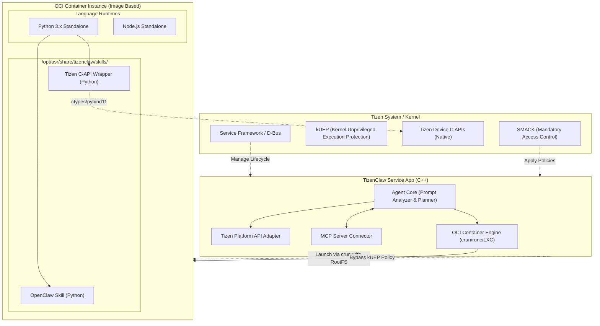

# TizenClaw System Design Document

---

## 1. Overview

**TizenClaw** is a native agent runtime optimized for the Tizen Embedded Linux environment. Built as a **daemon** in native C++, it runs in the system background, receives user prompts, and dynamically executes skills. It establishes a safe and extensible Agent-Skill interaction environment even under Tizen's strict security policies (SMACK, DAC, kUEP).

### System Environment

- **OS**: Tizen Embedded Linux (Tizen 10.0)
- **Security**: SMACK + DAC enforced
- **Kernel Protection**: kUEP (Kernel Unprivileged Execution Protection) enabled

---

## 2. System Architecture

---

## 3. Requirements

### 3.1 Functional Requirements

- **Agent Core Runtime**: Native C++ based. Prompt-driven action planning. MCP integration
- **Skills Execution Environment**: Dynamic loading from `/opt/usr/share/tizenclaw/skills/`. Tizen C API ctypes wrappers. OpenClaw skill compatibility
- **OCI Container**: `crun`-based filesystem isolation. Alpine Linux RootFS. kUEP bypass support

### 3.2 Non-Functional Requirements

- **Deployment**: Tizen System Service App (C++ Native), signed with Platform/System privileges
- **Runtime**: Python/Node.js encapsulated inside Container RootFS image (no host installation required)

---

## 4. Core Module Design

### 4.1 System Service App
- Based on Tizen Application Framework with full ecosystem integration
- App Manager lifecycle management. System App privileges + SMACK exception policies

### 4.2 Lightweight Container (Image-based) with kUEP Bypass
- Direct execution of OCI-compatible `crun` runtime instead of Docker
- Alpine Linux RootFS tarball → mounted at a designated path
- OCI spec (`config.json`) assigns capabilities, namespace partitioning, and kUEP bypass

### 4.3 Runtime Encapsulation
- Python/Node.js encapsulated inside Container RootFS image
- Skill scripts injected into container via external volume mounts

### 4.4 Dynamic Skills
- **Skills directory**: `/opt/usr/share/tizenclaw/skills/`
- AgentCore identifies required skills → executes `python3 skill.py` inside the container → parses `stdout` JSON
- Tizen Device APIs are incrementally ported via `ctypes` Python wrappers

### 4.5 MCP (Model Context Protocol) Integration
- MCP Server Connector connects to external MCP clients via sockets/pipes
- Data exchange using standard MCP format

---

## 5. Initial Development Phases (Phase 1–5)

### Phase 1: Foundation Architecture ✅
C++ System Service App skeleton, IPC design, Prompt Planner structure

### Phase 2: Container Execution Environment ✅
- `crun`-based OCI runtime integration, RootFS execution logic
- Dynamic `config.json` generation, Namespace partitioning (User, PID, Mount, Network)

### Phase 3: Imaging & Runtime Encapsulation ✅
- Alpine + Python/Node.js RootFS tarball creation
- RootFS included in RPM packaging, kUEP constraint bypass verified

### Phase 4: Skills System & API Wrapper ✅
- Skill folder monitoring and manifest reading, ctypes Python wrappers
- OpenClaw-compatible basic skill set verified

### Phase 5: MCP Server & End-to-End Validation ✅
- MCP protocol connection completed, full pipeline established
- LLM → Tizen Agent → Tizen API calls → LLM response
