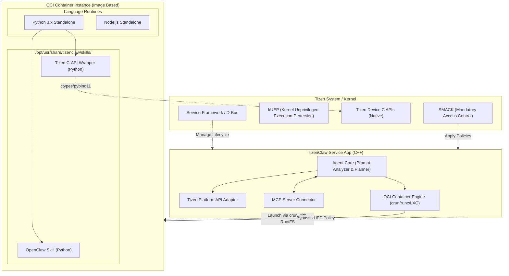

# TizenClaw 설계 문서 (System Design Document)

---

## 1. 개요

**TizenClaw**는 Tizen Embedded Linux 환경에 최적화된 Native Agent 구동 체계입니다. Native C++로 개발된 **Daemon** 형태로 시스템 백그라운드에서 동작하며, Prompt를 받아 동적으로 Skills를 구동합니다. Tizen의 보안 정책(SMACK, DAC, kUEP) 하에서도 안전하고 확장 가능한 Agent-Skill 상호작용 환경을 구축합니다.

### 시스템 구동 환경

- **OS**: Tizen Embedded Linux (Tizen 10.0 기준)
- **보안 환경**: SMACK + DAC 적용
- **커널 보호**: kUEP 활성화 상태

---

## 2. 시스템 아키텍처

---

## 3. 요구사항

### 3.1 기능 요구사항

- **Agent Core Runtime**: Native C++ 기반. 프롬프트 기반 행동 결정. MCP 연동
- **Skills 구동 환경**: `/opt/usr/share/tizenclaw/skills/` 동적 로드. Tizen C API ctypes 래퍼. OpenClaw 스킬 호환
- **OCI 컨테이너**: `crun` 기반 파일시스템 격리. Alpine Linux RootFS. kUEP 우회 지원

### 3.2 비기능 요구사항

- **배포**: Tizen System Service App (C++ Native), Platform/System 권한 서명
- **런타임**: Container RootFS 이미지 내부에 Python/Node.js 캡슐화 (호스트 설치 불필요)

---

## 4. 핵심 모듈 설계

### 4.1 System Service App
- Tizen Application Framework 기반. 표준 패키징과 생태계 통합
- App Manager 라이프사이클 관리. System App 권한 + SMACK 예외 설정

### 4.2 경량 컨테이너 (Image 기반) 및 kUEP 우회
- Docker 대신 OCI 호환 `crun` 런타임 직접 실행
- Alpine Linux RootFS tarball → 특정 경로에 마운트
- OCI 스펙(`config.json`)으로 Capabilities 부여, Namespace 분할, kUEP 우회

### 4.3 런타임 캡슐화
- Container RootFS 이미지 내부에 Python/Node.js 캡슐화
- 스킬 스크립트는 외부 볼륨 마운트로 컨테이너에 주입

### 4.4 스킬 탑재 (Dynamic Skills)
- **스킬 저장소**: `/opt/usr/share/tizenclaw/skills/`
- AgentCore가 필요한 스킬을 식별 → Container 내에서 `python3 skill.py` 실행 → `stdout` JSON 파싱
- Tizen Device API는 `ctypes` Python 래퍼로 단계적 포팅

### 4.5 MCP (Model Context Protocol) 연동
- MCP Server Connector가 소켓/파이프로 외부 MCP 클라이언트와 연결
- 표준 MCP 포맷으로 데이터 교환

---

## 5. 초기 개발 Phase 상세 (Phase 1~5)

### Phase 1: 기반 아키텍처 구축 ✅
C++ System Service App 스켈레톤, IPC 설계, Prompt Planner 구조

### Phase 2: 실행 환경(Container) 구축 ✅
- `crun` 기반 OCI 런타임 연동, RootFS 실행 로직
- `config.json` 동적 생성, Namespace 분할 (User, PID, Mount, Network)

### Phase 3: 이미징 및 런타임 캡슐화 ✅
- Alpine + Python/Node.js RootFS 타볼 생성
- RPM 패키징 시 RootFS 포함, kUEP 제약 회피 검증

### Phase 4: Skills 시스템 및 API 래퍼 구축 ✅
- 스킬 폴더 감시 및 매니페스트 읽기, ctypes Python 래퍼
- OpenClaw 호환 기본 스킬셋 구동 확인

### Phase 5: MCP 서버 및 실증 적용 ✅
- MCP 프로토콜 연결, 전체 파이프라인 완성
- LLM → Tizen Agent → Tizen API 호출 → LLM 응답
