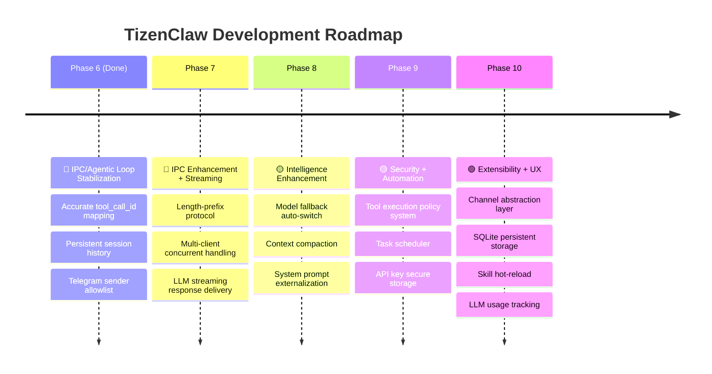

# TizenClaw Development Roadmap v2.0

> **Date**: 2026-03-05
> **Reference**: [Project Analysis](ANALYSIS.md) | [System Design](DESIGN.md)

---

## Roadmap Overview

---

## Phase 6: IPC/Agentic Loop Stabilization 🔴

> **Goal**: Fix critical Agentic Loop flaws, ensure data persistence, basic security hardening

### 6.1 Accurate tool_call_id Mapping
| Item | Details |
|------|---------|
| **Current Issue** | `call_0`, `toolu_0` hardcoded — results get mixed up during parallel tool calls |
| **Reference** | OpenClaw `tool-call-id.ts` (8,197 LOC) |
| **Scope** | Track actual IDs from LLM responses in `AgentCore::ProcessToolCalls()` |

**Target Files:**
- `src/tizenclaw/agent_core.cc` — tool_call result mapping logic
- `src/tizenclaw/llm_backend.hh` — `LlmToolCall` struct ID field check
- Each backend (`gemini_backend.cc`, `openai_backend.cc`, `anthropic_backend.cc`, `ollama_backend.cc`) — extract actual IDs during response parsing

**Completion Criteria:**
- [ ] Each backend accurately parses `tool_call_id`
- [ ] `AgentCore` maps results to original IDs during feedback
- [ ] E2E test passes with 2+ parallel tool calls

---

### 6.2 Persistent Session History
| Item | Details |
|------|---------|
| **Current Issue** | `std::map<string, vector<LlmMessage>>` in-memory — all lost on daemon restart |
| **Reference** | NanoClaw `db.ts` (SQLite), OpenClaw `session-files.ts` (file-based) |
| **Implementation** | JSON file-based (`/opt/usr/share/tizenclaw/sessions/{session_id}.json`) |

**Target Files:**
- [NEW] `src/tizenclaw/session_store.cc/hh` — session serialization/deserialization
- `src/tizenclaw/agent_core.cc` — load on init, save on turn completion
- `src/tizenclaw/agent_core.hh` — `SessionStore` member addition

**Completion Criteria:**
- [ ] Previous conversation context maintained after daemon restart
- [ ] Per-session max file size limit (e.g., 512KB)
- [ ] Graceful fallback on corrupted JSON file load
- [ ] Unit tests: save/load/trimming

---

### 6.3 Telegram Sender Allowlist
| Item | Details |
|------|---------|
| **Current Issue** | Anyone with the bot token can issue commands |
| **Reference** | NanoClaw `sender-allowlist.ts` (3,142 LOC) |
| **Implementation** | `allowed_chat_ids` array in `telegram_config.json` |

**Target Files:**
- `skills/telegram_listener/telegram_listener.py` — `allowed_chat_ids` validation
- `data/telegram_config.json.sample` — add field to sample

**Completion Criteria:**
- [ ] Empty `allowed_chat_ids` allows all users (backward compatible)
- [ ] Messages from unlisted `chat_id` ignored + logged
- [ ] Unit tests

---

## Phase 7: IPC Enhancement + Streaming 🔴

> **Goal**: Multi-client concurrent handling, streaming responses, robust message framing

### 7.1 Length-Prefix IPC Protocol
| Item | Details |
|------|---------|
| **Current Issue** | `shutdown(SHUT_WR)` EOF detection — only 1 request per connection |
| **Reference** | NanoClaw sentinel markers, OpenClaw WebSocket |
| **Implementation** | `[4-byte length][JSON payload]` framing |

**Target Files:**
- `src/tizenclaw/tizenclaw.cc` — `IpcServerLoop()` refactor
- `skills/telegram_listener/telegram_listener.py` — client-side protocol update
- `skills/mcp_server/server.py` — MCP client protocol update

**Completion Criteria:**
- [ ] Multiple requests/responses on a single connection
- [ ] Backward-compatible with existing `shutdown(SHUT_WR)` (detect and fallback)
- [ ] IPC integration test

---

### 7.2 Multi-Client Concurrent Handling
| Item | Details |
|------|---------|
| **Current Issue** | Sequential `accept()` in while loop — only one client at a time |
| **Reference** | NanoClaw `GroupQueue` (fair scheduling), OpenClaw parallel sessions |
| **Implementation** | `std::thread` pool or per-connection thread creation |

**Target Files:**
- `src/tizenclaw/tizenclaw.cc` — per-client thread creation
- `src/tizenclaw/agent_core.cc` — per-session mutex (concurrent access protection)
- `src/tizenclaw/agent_core.hh` — `std::mutex` member addition

**Completion Criteria:**
- [ ] Telegram + MCP simultaneous requests both receive responses
- [ ] No session data race conditions (TSAN pass)

---

### 7.3 LLM Streaming Response Delivery
| Item | Details |
|------|---------|
| **Current Issue** | Waits for full LLM response before delivery — perceived delay on long responses |
| **Reference** | OpenClaw SSE/WebSocket streaming, NanoClaw `onOutput` callback |
| **Implementation** | Chunked IPC responses (`type: "stream_chunk"` / `"stream_end"`) |

**Target Files:**
- Each LLM backend — streaming API call support
- `src/tizenclaw/agent_core.cc` — streaming callback propagation
- `src/tizenclaw/tizenclaw.cc` — chunk delivery via IPC socket
- `skills/telegram_listener/telegram_listener.py` — streaming reception

**Completion Criteria:**
- [ ] Tokens delivered to client simultaneously with LLM generation
- [ ] Progressive response display in Telegram during "typing..."

---

## Phase 8: Intelligence Enhancement 🟡

> **Goal**: Maximize LLM utilization efficiency, fault resilience, user experience improvement

### 8.1 Model Fallback Auto-Switch
| Item | Details |
|------|---------|
| **Current Issue** | Returns error only on LLM API failure — doesn't try other configured backends |
| **Reference** | OpenClaw `model-fallback.ts` (18,501 LOC) |
| **Implementation** | `fallback_backends` array in `llm_config.json`, sequential retry on failure |

**Completion Criteria:**
- [ ] Gemini API failure → automatic switch to OpenAI/Ollama
- [ ] Fallback attempts logged via dlog
- [ ] Backoff + retry on rate_limit errors

---

### 8.2 Context Compaction
| Item | Details |
|------|---------|
| **Current Issue** | Simple FIFO deletion after 20 turns — important context lost |
| **Reference** | OpenClaw `compaction.ts` (15,274 LOC) |
| **Implementation** | Summarize old turns via LLM when threshold exceeded → compress to 1 turn |

**Completion Criteria:**
- [ ] Oldest 10 turns summarized by LLM when exceeding 15 turns
- [ ] Fallback to existing FIFO trimming on summarization failure
- [ ] `[compressed]` marker on summarized turns

---

### 8.3 System Prompt Externalization
| Item | Details |
|------|---------|
| **Current Issue** | System prompt hardcoded in C++ — requires rebuild to change |
| **Reference** | NanoClaw per-group `CLAUDE.md`, OpenClaw `system-prompt.ts` |
| **Implementation** | `system_prompt` field in `llm_config.json` or external text file |

**Completion Criteria:**
- [ ] Load system prompt from external file/config
- [ ] Dynamically include skill list in prompt
- [ ] Use default hardcoded prompt if no config present (backward compatible)

---

## Phase 9: Security + Automation 🟡

> **Goal**: Tool execution safety, scheduled tasks, API key security

### 9.1 Tool Execution Policy System
| Item | Details |
|------|---------|
| **Current Issue** | All LLM-requested skills execute unconditionally |
| **Reference** | OpenClaw `tool-policy.ts` (5,902 LOC), `tool-loop-detection.ts` |
| **Implementation** | Per-skill `risk_level` (low/medium/high) + confirmation before high-risk execution |

**Completion Criteria:**
- [ ] Side-effect skills (`launch_app`, `vibrate_device`) have `risk_level: "medium"` or higher
- [ ] Detect and block same-skill + same-args repeated 3 times (loop prevention)
- [ ] Explain policy violation reason in LLM feedback

---

### 9.2 Task Scheduler
| Item | Details |
|------|---------|
| **Current Issue** | `schedule_alarm` is a simple timer — no repeat/cron support, no LLM integration |
| **Reference** | NanoClaw `task-scheduler.ts` (8,011 LOC) — cron, interval, one-shot |
| **Implementation** | New skill set (`create_task`, `list_tasks`, `cancel_task`) + daemon scheduler loop |

**Completion Criteria:**
- [ ] "Tell me the weather every day at 9 AM" → cron task creation → automatic execution
- [ ] Task listing and cancellation supported
- [ ] Task execution history logged

---

### 9.3 API Key Secure Storage
| Item | Details |
|------|---------|
| **Current Issue** | API keys stored in plaintext in `llm_config.json` |
| **Reference** | OpenClaw `secrets/`, NanoClaw stdin delivery |
| **Implementation** | Tizen KeyManager C-API integration or encrypted file |

**Completion Criteria:**
- [ ] Encrypted API key storage/retrieval when KeyManager available
- [ ] Fallback to existing plaintext file when KeyManager unsupported
- [ ] Documentation guide for removing API keys from `llm_config.json`

---

## Phase 10: Extensibility + UX 🟢

> **Goal**: Architecture flexibility, long-term data management, user convenience

### 10.1 Channel Abstraction Layer
| Item | Details |
|------|---------|
| **Current Issue** | Telegram and MCP are completely separate implementations — large code changes for new channels |
| **Reference** | NanoClaw `channels/registry.ts` (self-registration pattern) |
| **Implementation** | `Channel` interface (C++) → `TelegramChannel`, `McpChannel` implementations |

**Completion Criteria:**
- [ ] New channels added by implementing interface only
- [ ] Independent per-channel configuration (`channels/` directory)

---

### 10.2 SQLite Persistent Storage
| Item | Details |
|------|---------|
| **Current Issue** | All data is in-memory or individual JSON files |
| **Reference** | NanoClaw `db.ts` (19,515 LOC) — messages, tasks, sessions, groups |
| **Implementation** | Use Tizen's built-in SQLite |

**Storage Targets:**
- [ ] Session history (file → DB migration from Phase 6.2)
- [ ] Skill execution history (skill name, args, result, duration)
- [ ] Scheduled tasks (Phase 9.2 integration)
- [ ] LLM API call logs (token usage)

---

### 10.3 Skill Hot-Reload
| Item | Details |
|------|---------|
| **Current Issue** | Daemon restart required for new skills |
| **Reference** | OpenClaw runtime skill updates |
| **Implementation** | `inotify` file change detection → automatic manifest reload |

**Completion Criteria:**
- [ ] Auto-detect new skill directory added to `/opt/usr/share/tizenclaw/skills/`
- [ ] Reload on existing skill `manifest.json` modification

---

### 10.4 LLM Usage Tracking
| Item | Details |
|------|---------|
| **Current Issue** | No API call cost/usage tracking |
| **Reference** | OpenClaw `usage.ts` (4,898 LOC) |
| **Implementation** | Parse `usage` field from each backend response → aggregate |

**Completion Criteria:**
- [ ] Per-session token usage output via `dlog`
- [ ] Daily/monthly aggregate storage (SQLite integration)

---

## Phase Progress Summary

| Phase | Core Goal | Est. Size | Dependencies |
|:-----:|-----------|:---------:|:------------:|
| **6** | Agentic Loop stabilization + data persistence | ~800 LOC | None |
| **7** | IPC enhancement + streaming | ~1,200 LOC | Phase 6 |
| **8** | Maximize LLM utilization | ~600 LOC | Phase 6 |
| **9** | Security + automation | ~1,500 LOC | Phase 7, 8 |
| **10** | Extensibility + UX | ~2,000 LOC | Phase 9 |

> **Total estimated additional code**: ~6,100 LOC (current ~3,770 LOC → ~9,870 LOC)
